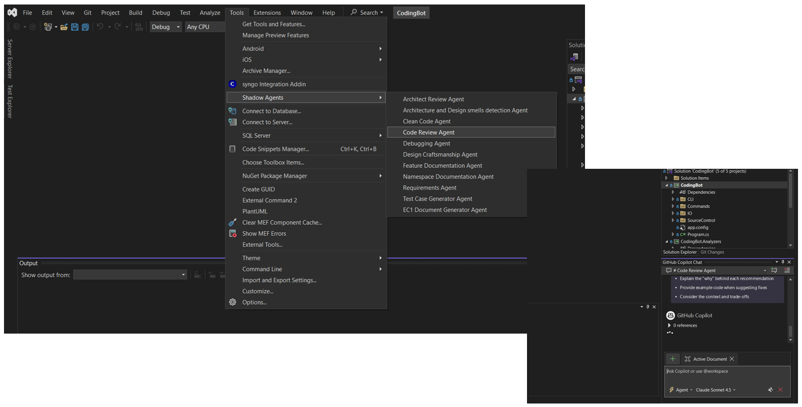

# ShadowPilot - Conceptual Design Document

## Executive Summary

**ShadowPilot** is a Visual Studio extension that transforms GitHub Copilot from a single general-purpose AI assistant into a customizable team of specialized AI agents. It addresses the fundamental limitation of stateless AI interactions by introducing persistent, reusable, and shareable agent definitions that enhance developer productivity and team collaboration.

---

## Core Concept

### The Vision

Imagine a development environment where you can instantly summon specialized AI experts for any task:
- Need a code review? Call the **Senior Code Reviewer** agent
- Working on architecture? Summon the **Architecture Advisor** agent
- Writing tests? Activate the **Test Expert** agent
- Refactoring legacy code? Engage the **Modernization Specialist** agent

**ShadowPilot makes this vision a reality** by extending GitHub Copilot's capabilities without modifying its core functionality.

### The Philosophy

1. **Simplicity First** - Complex solutions shouldn't require complex tools
2. **Developer Autonomy** - Empower developers to create their own tools
3. **Team Alignment** - Enable knowledge sharing through code
4. **Non-Invasive Design** - Enhance without disrupting existing workflows
5. **Open Extensibility** - Allow unlimited customization

---

## Problem Space Analysis

### The Context Problem

**Scenario**: A developer wants to perform a thorough code review focusing on:
- Security vulnerabilities
- Performance bottlenecks
- Code maintainability
- SOLID principles adherence
- Team coding standards

**Without ShadowPilot:**
1. Open GitHub Copilot Chat
2. Type out detailed instructions (200+ words)
3. Wait for response
4. Realize you forgot to mention a guideline
5. Re-type instructions
6. **Repeat this process for EVERY code review session**
7. Different team members use different prompts → inconsistent results

**With ShadowPilot:**
1. Click **Extensions → Copilot Agents → Code Reviewer**
2. Done. The agent is ready with all instructions pre-loaded

**Time Saved**: 5-10 minutes per session  
**Consistency Gained**: 100% - everyone uses the same expert agent

### The Specialization Problem

GitHub Copilot is designed as a generalist - it tries to help with everything. But **expertise requires specialization**.

**Analogy**: You wouldn't ask a general practitioner to perform brain surgery. Similarly, you shouldn't ask a generic AI to perform specialized tasks without proper context.

**ShadowPilot Solution**: Create specialized agents with deep expertise in specific domains:
- **Code Security Agent** - Trained on OWASP guidelines, CVE patterns, secure coding practices
- **Performance Optimization Agent** - Focused on profiling, caching strategies, algorithm efficiency
- **Clean Code Agent** - Expert in refactoring patterns, SOLID principles, code smells

### The Collaboration Problem

**Challenge**: How do you ensure that:
- All team members follow the same review standards?
- New team members onboard quickly?
- Best practices are consistently applied?
- Tribal knowledge doesn't stay in people's heads?

**Traditional Solution**: Documentation (which gets outdated and ignored)

**ShadowPilot Solution**: Encode knowledge as executable agents
- Agent files are version controlled
- Everyone gets the same expert guidance
- Updates propagate automatically
- Best practices become living code

---

## Architectural Concepts

### Agent-as-Code Philosophy

**Core Principle**: If infrastructure can be code, and configuration can be code, then **AI instructions can be code too**.

```
Traditional Approach:          ShadowPilot Approach:
-----------------              ------------------
Instructions in head    →      Instructions in files
Manual repetition       →      One-click execution
Inconsistent results    →      Deterministic behavior
Tribal knowledge        →      Shared knowledge base
```

### The File-Based Agent Model

**Why Files?**
1. **Version Control** - Track changes, roll back, branch
2. **Portability** - Share across teams, organizations, projects
3. **Simplicity** - No database, no server, no complexity
4. **Transparency** - Anyone can read and understand
5. **Ownership** - Developers control their own agents

**Agent Anatomy**:
```markdown
# Agent Definition File (CodeReviewer.md)

# Role Definition
You are a Senior Code Reviewer with 15+ years of experience...

# Domain Expertise
Focus on security, performance, and maintainability...

# Guidelines
1. Always check for SQL injection vulnerabilities
2. Verify proper error handling
3. Ensure unit tests cover edge cases
...

# Output Format
Provide feedback in this structure:
- Critical Issues (must fix)
- Recommendations (should fix)
- Suggestions (nice to have)
```

### Dynamic Discovery Pattern

**Traditional Extension Approach**:
```
Hard-coded commands → Compile → Deploy → Restart VS
```

**ShadowPilot Approach**:
```
Drop file in folder → Instant availability
```

**Benefits**:
- Zero deployment friction
- Rapid iteration cycles
- User-driven extensibility
- No programming required

### The Injection Architecture

**Challenge**: How to interact with GitHub Copilot Chat without breaking its functionality?

**Solution**: Programmatic text injection via VS SDK

```
Step 1: Open Copilot Chat (CommandID invocation)
   ↓
Step 2: Wait for chat input to become active (timing)
   ↓
Step 3: Get WPF text buffer (IVsTextManager)
   ↓
Step 4: Clear existing content
   ↓
Step 5: Insert agent instructions
   ↓
Step 6: Copilot processes as if user typed it
```

**Key Insight**: We don't modify Copilot - we automate the user's workflow.

### Visual Architecture Flow



*The complete user action flow from agent selection in Visual Studio to Copilot Chat response, demonstrating the non-invasive injection architecture.*

---

## Design Patterns

### 1. Strategy Pattern (Agent Selection)

Each agent represents a different strategy for interacting with Copilot:
```
Context: Developer's task
Strategy: Specific agent (CodeReviewer, TestGenerator, etc.)
Behavior: Unique instruction set and guidelines
```

### 2. Template Method Pattern (Agent Structure)

All agents follow a consistent structure:
```
1. Role Definition (Who is the AI?)
2. Domain Expertise (What does it know?)
3. Guidelines (How should it behave?)
4. Output Format (What should it produce?)
```

### 3. Plugin Architecture (Extension Model)

ShadowPilot itself acts as a plugin host:
```
Core Extension (ShadowPilot)
    ├── Plugin 1 (Agent Definition 1)
    ├── Plugin 2 (Agent Definition 2)
    └── Plugin N (Agent Definition N)
```

### 4. Observer Pattern (Menu Refresh)

Menu items observe the filesystem:
```
File added/modified → Event triggered → Menu updated
```

---

## Technical Innovations

### 1. Zero-Configuration Discovery

**Innovation**: No manifest, no registration, no configuration files.

**Mechanism**:
```csharp
// Scan directory for .md files
var mdFiles = Directory.GetFiles(@"d:\Agents", "*.md");

// Generate menu items dynamically
foreach (var file in mdFiles) {
    CreateMenuItem(Path.GetFileNameWithoutExtension(file));
}
```

**Impact**: Users become extension developers without writing code.

### 2. Real-Time Menu Synchronization

**Innovation**: Menu reflects filesystem state without restart.

**Mechanism**:
```csharp
// BeforeQueryStatus fires before menu display
private void MenuItem_BeforeQueryStatus(object sender, EventArgs e) {
    LoadAgentsFromFile(); // Refresh agent list
    UpdateMenuText();     // Update menu items
}
```

**Impact**: Instant feedback loop for agent development.

### 3. Non-Invasive Integration

**Innovation**: Enhance Copilot without modifying it.

**Mechanism**:
- Use public VS SDK APIs only
- Invoke Copilot via command ID
- Manipulate text buffer through standard interfaces
- No hooks, no patches, no modifications

**Impact**: Compatible with all Copilot updates, no version lock-in.

### 4. Declarative Agent Definitions

**Innovation**: Define AI behavior using plain markdown.

**Example**:
```markdown
# You are a Security Auditor

Review code for these vulnerabilities:
- SQL Injection
- XSS attacks
- CSRF vulnerabilities
- Authentication bypasses
```

**Impact**: Non-programmers can create sophisticated AI agents.

---

## Use Case Scenarios

### Scenario 1: Enterprise Code Review

**Context**: Large enterprise with 50+ developers, strict coding standards.

**Problem**:
- Inconsistent code reviews
- Junior developers lack expertise
- Senior developers overwhelmed with reviews

**ShadowPilot Solution**:
```
1. Senior architect creates "Enterprise Code Reviewer" agent
2. Agent encodes all company standards and best practices
3. All developers use the same agent
4. Consistent, high-quality reviews across the organization
5. Junior developers learn from agent feedback
```

**Outcome**: 70% reduction in review cycle time, improved code quality.

### Scenario 2: Legacy Modernization Project

**Context**: Migrating 100K+ lines of .NET Framework code to .NET 8.

**Problem**:
- Complex refactoring patterns
- Need consistent approach across codebase
- Multiple developers working in parallel

**ShadowPilot Solution**:
```
Agents Created:
- "DotNet Framework to Core Migrator"
- "Async/Await Converter"
- "Dependency Injection Refactorer"
- "EF6 to EF Core Migrator"

Process:
1. Each developer uses appropriate agent for their module
2. Agents ensure consistent patterns
3. Code reviews use "Migration Validator" agent
```

**Outcome**: 3-month timeline met, zero breaking changes in production.

### Scenario 3: Open Source Project Contribution

**Context**: Popular OSS project with 100+ contributors.

**Problem**:
- Varying code quality from contributors
- Maintainers spend too much time on reviews
- Contribution guidelines often ignored

**ShadowPilot Solution**:
```
Repository includes:
- README.md (project docs)
- CONTRIBUTING.md (contribution guide)
- .agents/ folder with project-specific agents
  - ContributionReviewer.md
  - StyleChecker.md
  - TestGenerator.md

Contributors:
1. Clone repository
2. Point ShadowPilot to .agents/ folder
3. Use project agents before submitting PR
```

**Outcome**: Higher quality PRs, faster merge times, happier maintainers.

### Scenario 4: Education and Onboarding

**Context**: Bootcamp teaching software development.

**Problem**:
- Students need guidance on best practices
- Instructors can't review every student's code
- Feedback needs to be consistent and educational

**ShadowPilot Solution**:
```
Course Agents:
- "Beginner Friendly Code Reviewer"
- "Design Patterns Tutor"
- "Test-Driven Development Coach"
- "Git Workflow Assistant"

Each agent provides:
- Constructive feedback
- Educational explanations
- Links to learning resources
- Encouragement and tips
```

**Outcome**: Students receive instant, consistent guidance. Instructors focus on complex questions.

---

## Future Vision

### Phase 1: Foundation (Current)
- File-based agent storage
- Dynamic menu generation
- GitHub Copilot integration
- Real-time updates

### Phase 2: Enhancement
- Configurable agent folder location
- Agent templates and wizards
- Agent categories/grouping
- Keyboard shortcuts for common agents
- Agent search and filter

### Phase 3: Collaboration
- Agent marketplace/registry
- Share agents via URL
- Agent rating and reviews
- Community agent library
- Team agent management UI

### Phase 4: Intelligence
- Context-aware agent suggestions
- Agent usage analytics
- Auto-improvement based on feedback
- Agent composition (combine multiple agents)
- Smart agent selection based on current file/project

### Phase 5: Ecosystem
- Multi-IDE support (VS Code, Rider, etc.)
- Integration with other AI services
- Agent testing and validation framework
- Agent performance monitoring
- Enterprise management console

---

## Design Principles

### 1. The Principle of Least Surprise
Users should never be confused about what an action will do.
- Clear naming (agent filename = menu item name)
- Predictable behavior (agent = prompt template)
- Transparent operation (see exactly what's sent to Copilot)

### 2. The Principle of Progressive Disclosure
Simple tasks should be simple; complex tasks should be possible.
- Basic agent: Just a markdown file with instructions
- Advanced agent: Complex prompts with variables, conditions, examples
- Expert agent: Orchestrated workflows combining multiple agents

### 3. The Principle of Shared Ownership
Tools should empower users to become creators.
- No gatekeepers (anyone can create an agent)
- No approval process (drop file, it works)
- No programming required (markdown is enough)

### 4. The Principle of Graceful Degradation
Failures should be informative, not destructive.
- Missing folder? Show helpful message
- Missing file? Explain what happened
- Copilot not installed? Graceful error
- Malformed agent? Display validation feedback

### 5. The Principle of Composability
Small pieces should combine into larger solutions.
- One agent, one responsibility
- Combine agents for workflows
- Chain agents for complex tasks
- Reuse agents across projects

---

## Security Considerations

### Agent Content Validation
- Agents are user-controlled markdown files
- No code execution in agent definitions
- Content is passed as-is to Copilot
- Users responsible for agent content

### Filesystem Access
- Read-only access to agent folder
- No write operations to system
- No network access required
- All operations local to machine

### Integration Safety
- Uses public VS SDK APIs only
- No private API access
- No Copilot internals modified
- Compatible with Copilot security model

---

## Success Metrics

### Developer Productivity
- **Time saved per session**: 5-10 minutes
- **Consistency improvement**: Near 100%
- **Learning curve**: < 5 minutes

### Team Collaboration
- **Agent reuse rate**: High (shared agents used by all)
- **Onboarding time reduction**: 30-50%
- **Knowledge sharing**: Codified in agents

### Code Quality
- **Review consistency**: Uniform standards applied
- **Best practices adherence**: Automated checking
- **Documentation quality**: Improved with specialized agents

---

## Target Audience

### Primary Users
1. **Professional Developers** - Need efficient, repeatable workflows
2. **Development Teams** - Require consistency and collaboration
3. **Tech Leads** - Want to encode and share best practices
4. **Open Source Maintainers** - Need to guide contributors

### Secondary Users
1. **Students** - Learning with guided AI assistance
2. **Bootcamp Instructors** - Teaching consistent practices
3. **Technical Writers** - Creating documentation with AI help
4. **Code Reviewers** - Automating review processes

---

## Competitive Advantage

### vs. Generic AI Assistants
- **ShadowPilot**: Specialized, persistent, shareable agents
- **Generic AI**: One-size-fits-all, stateless, personal

### vs. Custom Prompt Libraries
- **ShadowPilot**: Integrated into IDE, one-click access
- **Prompt Libraries**: Copy-paste from external source, manual

### vs. AI Code Review Tools
- **ShadowPilot**: Flexible, customizable, team-owned
- **Code Review Tools**: Fixed rules, vendor-controlled

---

## The ShadowPilot Difference

**Most tools give you fish. ShadowPilot teaches you to fish AND provides a fishing rod.**

1. **Immediate Value**: Pre-configured agents for common tasks
2. **Long-term Empowerment**: Create unlimited custom agents
3. **Team Multiplication**: Share expertise through code
4. **Future-Proof**: Adapts as AI capabilities evolve

---

## Conclusion

ShadowPilot represents a paradigm shift in how developers interact with AI assistants:

**From**: Stateless, generic, repetitive AI interactions  
**To**: Stateful, specialized, automated AI workflows

**From**: Personal prompt collections  
**To**: Shared team knowledge bases

**From**: One AI assistant  
**To**: A team of specialized AI agents

The future of AI-assisted development is not about better AI - it's about better **orchestration** of AI capabilities. ShadowPilot makes that future available today.

---

**"The best tool is the one that gets out of your way and lets you work."**

ShadowPilot: Your AI agents, always ready.
